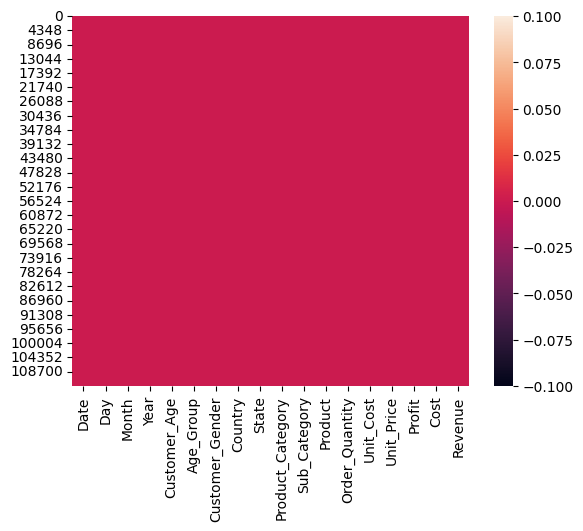
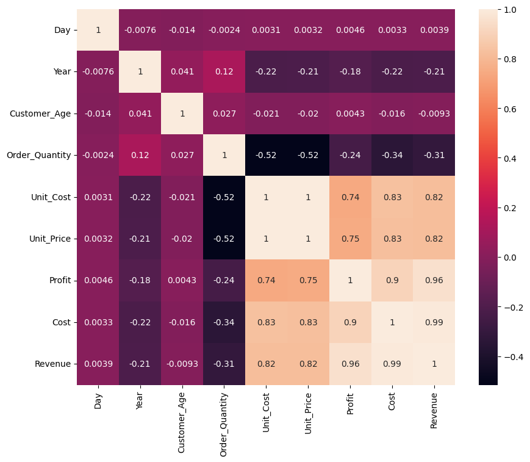
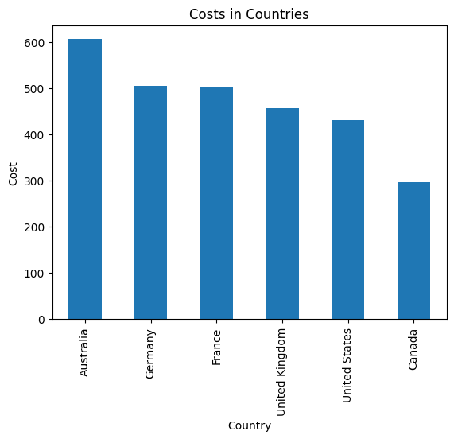
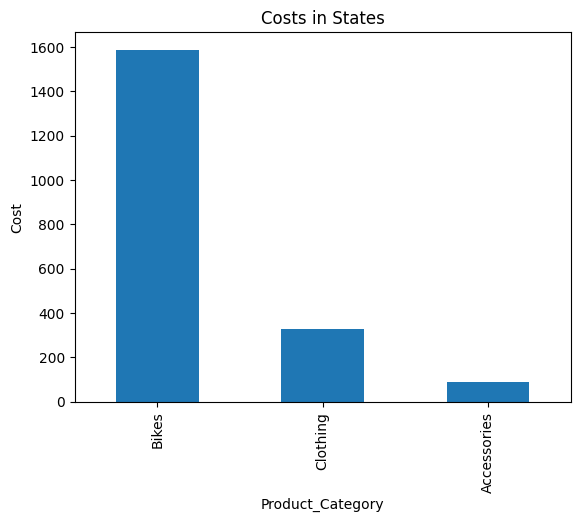
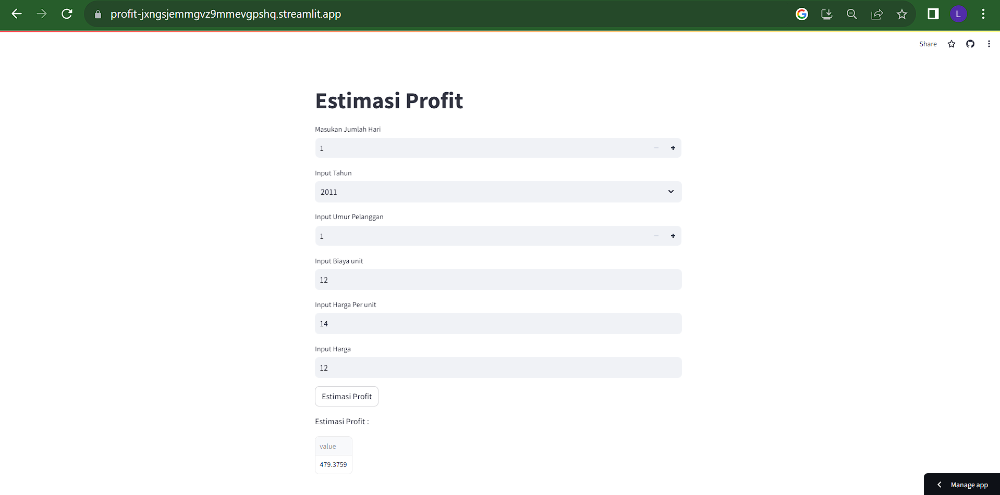

# Laporan Proyek Machine Learning

### Nama : Indra Setiawan

### Nim : 211351066

### Kelas : Pagi B

## Domain Proyek

Penjualan sepeda pada pelanggan untuk menyesuaikan sepeda mereka dan memprediksi profit penjualan dari sepeda

## Business Understanding
profit dalam bisnis sepeda juga melibatkan analisis keuangan yang cermat. Ini mencakup perhitungan profit margin, break-even point, dan penggunaan laporan keuangan untuk mengukur profitabilitas

Bagian laporan ini mencakup:

### Problem Statements

Kebutuhan dan preferensi pelanggan terhadap jenis sepeda yang beragam memerlukan manajemen inventaris yang kompleks

### Goals

Ini dapat dicapai dengan meningkatkan harga jual, menjual sepeda dengan margin keuntungan yang lebih tinggi, atau menarik lebih banyak pelanggan.

### Solution statements

- Melakukan investasi dalam pengembangan merek dan branding yang kuat
- pengembangan produk untuk menciptakan sepeda yang inovatif dan menarik, termasuk sepeda listrik dengan teknologi terkini.

## Data Understanding

Dataset yang saya gunakan berasal jadi Kaggle yang berisi tentang Bike store sales in europa.Dataset ini mengandung 113036 baris dan 18 columns.<br>

[Bike Sales In Europe](https://www.kaggle.com/datasets/sadiqshah/bike-sales-in-europe).

Selanjutnya menguraikan seluruh variabel atau fitur pada data

### Variabel-variabel pada  adalah sebagai berikut:

- Date                   :Menunjukan tanggal = object
- Day                    :Menunjukan Hari = int64
- Month                  :Menunjukan Bulan = object
- Year                   :Menunjukan Tahun = int64
- Costumer_Age           :Menunjukan umur pelanggan = int64
- Age_Group              :Menunjukan kelompok usia = object
- Costumer_Gender        :Menunjukan gender pelanggan = object
- Country                :Menunjukan Negara = object
- State                  :Menunjukan Bagian Negara = object
- Product_Category       :Menunjukan kategori produk dari accessories = object
- Sub_Categorhy          :Menunjukan rak sepeda = object
- Product                :Menunjukan produk sepeada = object
- Order_Quantity         :Menunjukan total yang akan di order = int64
- Unit_Cost              :Menunjukan biaya satuan = int64
- Unit_Price             :Menunjukan harga sepeda = int64
- Profit                 :Menunjukan Keuntungan dari penjualan sepeda = int64
- Cost                   :Menunjukan harga barang = int64

## Data Preparation

### Data Collection

Untuk data collection ini, saya mendapatkan dataset dari website kaggle

### Data Discovery And Profiling

Untuk bagian ini, Pertama kita mengimport semua library yang dibutuhkan dan mendownload token kaggle akun kita,

```bash
import pandas as pd
import numpy as np
import seaborn as sns
import matplotlib.pyplot as plt
from sklearn.model_selection import train_test_split
from sklearn.linear_model import LinearRegression
```

Karena kita menggunakan google colab untuk mengerjakannya maka kita akan import files juga,

```bash
from google.colab import files
```

Lalu mengupload token kaggle agar nanti bisa mendownload sebuah dataset dari kaggle melalui google colab

```bash
file.upload()
```

Setelah mengupload filenya, lanjut dengan membuat sebuah folder untuk menyimpan file kaggle.json yang sudah diupload tadi

```bash
!mkdir -p ~/.kaggle
!cp kaggle.json ~/.kaggle/
!chmod 600 ~/.kaggle/kaggle.json
!ls ~/.kaggle
```

lalu kita download datasetsnya

```bash
!kaggle datasets download -d sadiqshah/bike-sales-in-europe --force
```

Selanjutnya extract file yang tadi telah didownload

```bash
!mkdir -p sadiqshah/bike-sales-in-europe
!unzip  bike-sales-in-europe.zip -d sadiqshah/bike-sales-in-europe
!ls sadiqshah/bike-sales-in-europe
```

Lanjut dengan memasukkan file csv yang telah diextract pada sebuah variable, dan melihat 5 data paling atas dari datasetsnya

```bash
df = pd.read_csv('/content/sadiqshah/bike-sales-in-europe/Sales.csv')
df.head()
```

Untuk melihat mengenai type data dari masing masing kolom kita bisa menggunakan property info,

```bash
df.info()
```

Selanjutnya kita akan memeriksa apakah datasetsnya terdapat baris yang kosong atau null dengan menggunakan seaborn,

```bash
sns.heatmap(df.isnull())
```

 <br>

kita deskripsikan terlebih dahulu,

```bash
df.describe()
```

Lanjut dengan data exploration kita,

```bash
plt.figure(figsize=(10,8))
sns.heatmap(df.corr(), annot=True)
```



Data ini menunjukan harga sepeda dari berbagai negara

(df
 .groupby("Country")["Cost"]
 .mean()
 .sort_values(ascending=False)
 .plot(kind="bar",xlabel="Country", ylabel="Cost",title ="Costs in Countries")
);



Menunjukan harga dari provinsi

(df
 .groupby("Product_Category")["Cost"]
 .mean()
 .sort_values(ascending=False)
 .plot(kind="bar",xlabel="Product_Category", ylabel="Cost",title ="Costs in States")
);




## Modeling

Langkah pertama memasukkan kolom-kolom fitur yang ada di datasets dan juga kolom targetnya,

```bash
features = ['Day', 'Year', 'Customer_Age', 'Unit_Cost','Unit_Price', 'Cost',]
x = df[features]
y = df['Profit']
x.shape, y.shape
```

Selanjutnya kita tentukan berapa persen dari datasets yang akan digunakan untuk test dan untuk train

```bash
x_train, X_test, y_train, y_test = train_test_split(x, y, random_state=70)
y_test.shape
```

lalu buat mode dan memasukkan X_train dan y_train pada model dan memasukkan value predict pada y_pred,

```bash
lr = LinearRegression()
lr.fit(x_train,y_train)
pred = lr.predict(X_test)
```

sekarang kita bisa melihat score dari model yang sudah dibuat,

```bash
score = lr.score(X_test, y_test)
print('akurasi model regresi linier = ', score)
```

Bagus, 84%, kita test menggunakan array value

```bash
input_data = np.array([[200,2011,100,15,12,14]])
prediction = lr.predict(input_data)
print('Estimasi Profit : ', prediction)
```

berhasil!!, modelnya sudah selesai, selanjutnya kita export sebagai sav agar nanti bisa kita gunakan pada project web streamlit kita.

```bash
import pickle

filename = 'estimasi_profit.sav'
pickle.dump(lr,open(filename,'wb'))
```

## Evaluation

Disini saya menggunakan F1 score sebagai metrik evaluasi.

F1 Score: F1 score adalah rata-rata harmonis antara presisi dan recall. F1 score memberikan keseimbangan antara presisi dan recall. F1 score dihitung dengan menggunakan rumus: 2*(P*R/P+R)
```bash
from sklearn.metrics import precision_recall_curve, f1_score

threshold = 0.5

y_pred_binary = (pred > threshold).astype(int)
y_test_binary = (y_test > threshold).astype(int)

f1 = f1_score(y_test_binary, y_pred_binary)

print('f1 Score :', f1)
```
Hasil yang didapat adalah 99%. Jadi, model ini memiliki keseimbangan yang sangat baik antara presisi dan recall.

## Deployment

[My Estimation App](https://profit-jxngsjemmgvz9mmevgpshq.streamlit.app/).



##
